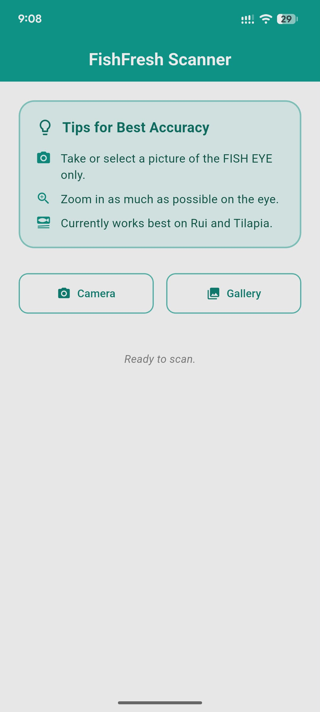
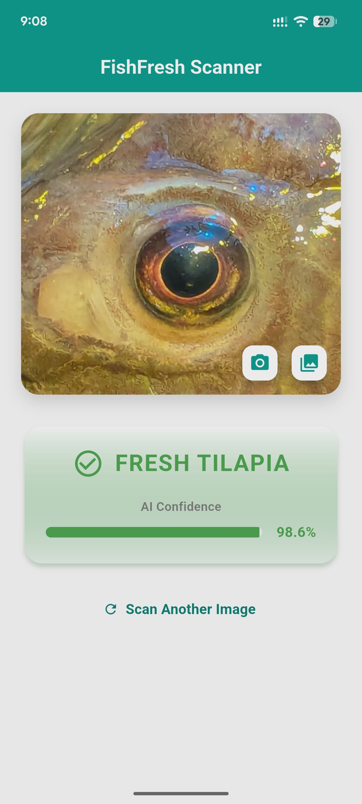
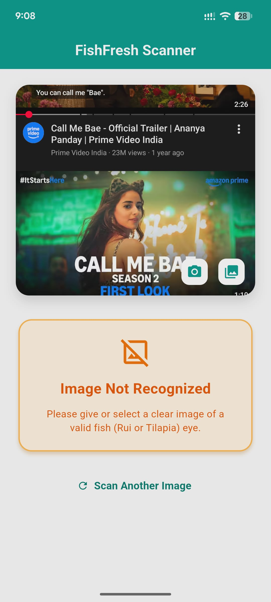

# 🐟 FishFresh Scanner

FishFresh Scanner is an intelligent, offline-first mobile application built with Flutter that uses Deep Learning to determine the freshness of fish based purely on a photograph of their eyes.

This project demonstrates a complete pipeline: training a Convolutional Neural Network (CNN) and deploying it to a mobile device using TensorFlow Lite.

---
## 📥 Download the App

Don't want to build from source? You can download the compiled Android app directly!

* 👉 **Download the latest APK** from the **Releases section** (Go to `Assets` → download the `.apk` file)

> ⚠️ **Note:** Since this app is not on the Google Play Store, your phone may ask you to allow **"Install from Unknown Sources"** when installing the APK.

---

## ✨ Key Features

* **Offline AI Inference**: Runs fully on-device using TensorFlow Lite (no internet required)
* **Smart Image Filtering (OOD Detection)**: Uses Google ML Kit to reject irrelevant images (e.g., humans, cars)
* **High Accuracy Model**: EfficientNetB0 achieved 100% validation accuracy
* **Modern UI**: Material 3 design with dynamic color feedback (Green = Fresh, Red = Stale)
* **Camera & Gallery Support**: Capture or upload images easily

---

## 🧠 AI Pipeline

### Step 1: Whitelist Pre-Check (Google ML Kit)

* Uses on-device object detection
* Accepts only aquatic-related images (Fish, Tilapia, Rui, Seafood)
* Rejects out-of-distribution inputs

### Step 2: Freshness Classification (TensorFlow Lite)

* Input resized to **224x224**
* Model: EfficientNetB0 (converted to TFLite)
* Output Classes:

    * ✅ Fresh Rui
    * ✅ Fresh Tilapia
    * ❌ Stale Rui
    * ❌ Stale Tilapia

---

## 📊 Model Performance

| Model          | Accuracy | Precision | Recall | F1 Score |
| -------------- | -------- | --------- | ------ | -------- |
| MobileNetV2    | 99%      | 0.99      | 0.99   | 0.99     |
| EfficientNetB0 | 100%     | 1.00      | 1.00   | 1.00     |

EfficientNetB0 was selected for deployment due to superior performance and stability.

---

## 📂 Project Structure

```
lib/
 ┣ screens/
 ┃ ┣ splash_screen.dart    # Initializes AI model
 ┃ ┗ home_screen.dart      # UI + Camera + Prediction
 ┣ services/
 ┃ ┗ tflite_service.dart   # Handles model inference
 ┗ main.dart               # App entry point
```

---

## 🚀 Getting Started

### Prerequisites

* Flutter SDK (>= 3.0)
* Android Studio / VS Code
* Emulator or physical Android device

### Installation

```bash
# Clone the repository
git clone https://github.com/SazzadHossin/fishfresh-scanner

# Navigate to project
cd fishfresh_scanner

# Install dependencies
flutter pub get

# Run the app
flutter run
```

> Note: The trained `.tflite` model is already included in the project.

---

## 📸 Screenshots


<p align="center">
  
  
   
</p>

---

## 📌 Notes

* Designed as an academic project
* Works completely offline
* Optimized for real-time mobile inference

---

## 🛠 Tech Stack

* Flutter
* TensorFlow Lite
* EfficientNetB0
* Google ML Kit

---

## 📄 License

This project is for academic and educational use.

---

## 🙌 Acknowledgements

* Flutter Team
* TensorFlow Team
* Google ML Kit

---

⭐ If you like this project, consider giving it a star on GitHub!
